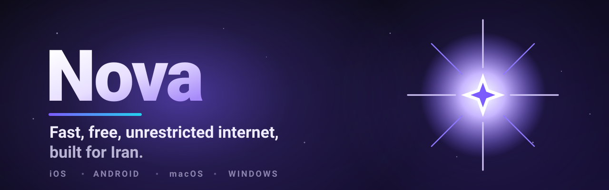

<a href="README.fa.md">🇮🇷 فارسی</a>

**A fast, modern VPN client for iPhone, Android, macOS and Windows, built for the networks people actually deal with in Iran.**

Tap the logo to connect. Bring the subscription you already have, or turn a VPS of your own
into a Nova server from inside the app. Full Persian and English, with a proper
right-to-left interface.

---

## 🌐 Links

---

## What is Nova

Nova is a lightweight, modern VPN client for **iPhone, Android, macOS and Windows**. Tap the logo to connect, and you get a clean dashboard that shows your country, public IP, ping, and live download and upload speed. It works with the subscription you already have, and it can build and manage your own private server for you, all from inside the app.

Nova is designed for difficult networks. It bundles the anti-censorship tools people in Iran actually need (TLS fragmenting, WARP, secure DNS, Iran direct-routing) behind a simple, one-tap interface, in full Persian and English.

### Highlights

- **One tap to connect.** A big Nova logo on the home screen is the connect button. Tap it and you are online; the status and a live timer sit right beside it.
- **Run your own server.** Hand Nova a VPS and it installs and configures the server for you, over SSH, from inside the app. No terminal, no copy-paste.
- **Find the fastest routes.** Nova Radar scans Cloudflare's network for clean, low-latency IPs and can push them straight to your panel.
- **Bring your own subscription.** Paste a sing-box, Clash, base64, or vless / vmess / trojan link and Nova handles the rest.

## Features in detail

### Connect and browse
- One-tap connect with a clean, single-screen dashboard.
- Live readout of your country (with flag), public IP, ping, and download and upload speed.
- Server list with a country flag and live latency for every config, plus an **Auto / Best server** mode that always routes through the fastest node.
- Mark servers as favorites and filter the list by protocol.
- Works with any subscription format: sing-box, Clash, base64, and vless / vmess / trojan links.

### Build and manage your own server (VPS)
- **Connect a VPS** with its address and your SSH key, and Nova installs the Nova server on it for you.
- **Pick your protocols**, including Hysteria2 for gaming, and Nova writes the configuration.
- **Add a domain** and Nova arranges the certificate, or run without one.
- **Manage users and inbounds** from inside the app: add someone, see who is using what, and hand out their subscription link.
- **Watch the node** live: traffic, connections, and whether each protocol is answering.

### Nova Radar (clean-IP finder)
- Scans Cloudflare's published IP ranges and measures real connection latency to each one.
- Sorts the results so the fastest, cleanest IPs are on top.
- One button to **send the best IPs straight to your panel**, so your configs use the fastest routes.
- Copy or export the list whenever you want.

### Anti-censorship and routing
- **TLS fragmenting** to get past deep packet inspection.
- **Iran direct-routing** so Iranian sites and apps stay fast and local.
- **WARP / WireGuard** support.
- **Secure DNS** over HTTPS (DoH).
- **Speed mode** and tuned latency testing.
- **Per-app proxy** (split tunneling) and a kill switch.
- Custom diversion rules for advanced routing.

### Insights and tools
- Usage statistics by day, week, month, and year.
- Built-in speed test.
- Backup and restore your whole setup to a local file.

### Designed for everyone
- Full Persian and English, with a proper right-to-left interface.
- Light and dark themes.
- Iran is shown with the Lion and Sun.

## Get Nova for your platform

| Platform | How to get it |
| --- | --- |
| **Android** | Download the single `arm64` APK from the [latest release](https://github.com/iiviirv/Nova-Client/releases/latest). It is a properly signed build now, and one `arm64` package covers essentially every phone from the last several years. An IzzyOnDroid / F-Droid listing is on the way. |
| **iPhone / iPad** | Via **TestFlight**: [join link](https://testflight.apple.com/join/bxfK3MyF). In Iran, install the TestFlight app and accept the invite with a non-Iranian Apple ID, since Apple blocks its services inside Iran. |
| **macOS** (Apple Silicon) | Download the macOS zip from the [latest release](https://github.com/iiviirv/Nova-Client/releases/latest), unzip, and open `nova_client.app` (right-click, then Open, the first time). |
| **Windows** (64-bit) | Download `Nova-Windows.zip` from the [latest release](https://github.com/iiviirv/Nova-Client/releases/latest), unzip anywhere, and run `nova_client.exe`. No admin needed. |

Android ships one `arm64` APK, so there is nothing to choose; it runs on essentially every phone from the last several years. The iPhone, macOS and Windows apps share one codebase, while Android is a dedicated native build. All four run the same sing-box and Xray core.

## Getting started

1. **Download and install.** Grab the `arm64` APK from the [Releases page](https://github.com/iiviirv/Nova-Client/releases/latest). You may need to allow installing apps from your browser or file manager.
2. **Add a connection.** Paste a subscription link you already have, or connect a VPS of your own and let Nova set it up.
3. **Connect.** Tap the Nova logo on the home screen. Android will ask once for VPN permission; allow it.
4. **Tune it (optional).** Open Radar to find faster IPs, or Settings to turn on TLS fragmenting, WARP, secure DNS, and per-app proxy.

## Privacy

Nova is a client you control. When you connect a VPS, the server is yours, on your own account. Your SSH key and panel password are stored only on your device, so you do not have to type them again.

## Community

Questions, feature requests, and clean-IP tips all live with the wider Nova community.

- Website: https://novaproxy.online/
- Telegram channel: https://t.me/irnova
- Telegram group: https://t.me/irnova_group
- YouTube: https://youtube.com/@novaproxyir
- X: https://x.com/irNovaProxy
- Instagram: https://www.instagram.com/irnova_team

## Credits and license

Nova is built on [sing-box](https://github.com/SagerNet/sing-box) and [Xray](https://github.com/XTLS/Xray-core), and is released under the GPL-3.0 license. See the sing-box [LICENSE](https://github.com/SagerNet/sing-box/blob/main/LICENSE) for the exact terms.

Built for Iran, and everyone who needs an open internet.

📖 [نسخهٔ فارسی / Persian version](README.fa.md)

